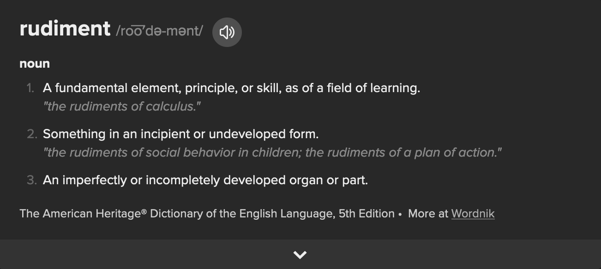

# Three Drum Rudiments

<iframe src="https://giphy.com/embed/Qw5jac4hmEsY8" width="480" height="386" frameBorder="0" class="giphy-embed" allowFullScreen></iframe>
<a href="https://giphy.com/gifs/reactiongifs-Qw5jac4hmEsY8">via GIPHY</a>

## Lesson Objectives

- Learn what a single-stroke roll is and how to play one.
- Learn what a double-stroke roll is and how to play one.
- **Bonus:** Learn what a paradidle is and how to play one.

### What is a rudiment??

