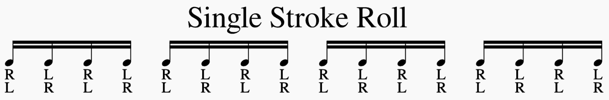
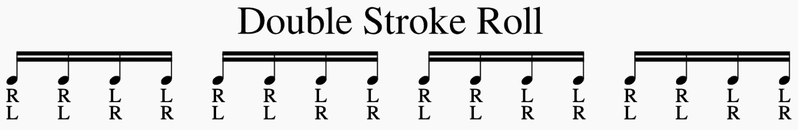

# Three Drum Rudiments

## Lesson Objectives

- Learn what a single-stroke roll is and how to play one.
- Learn what a double-stroke roll is and how to play one.
- **Bonus:** Learn what a paradidle is and how to play one.

### What is a rudiment??

While most drumming can be seen as very technical, at it's core, it is comprised of foundational rudiments that most anyone can grasp given time and patience.  We will take a look a few of these rudiments and see

### Single Stroke Roll

A single stroke roll consists of alternating drum strokes between your right hand and your left hand in a consistent pattern.  This rudiment typically takes the form of eight or sixteenth notes when played to a metronome.

### Double Stroke Roll

A double stroke roll consists of the same alternating feel but rather than one stroke or beat per hand, the drummer will play two per hand.  Like the single stroke roll this rudiment typically takes the form of eight or sixteenth notes when played to a metronome.

### (Single) Paradiddle

A paradiddle is a more complex rudiment and can be seen as a combination of a single and double stroke roll.  The total sequence of the rudiment comprises of two single strokes followed by a double stroke.  It is an extremely challenging rudiment to practice but helps drummers ( or anyone interested in rhythm ) feel comfortable with more complex techniques in drumming and beyond.

